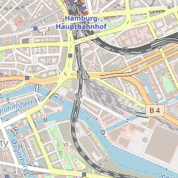

# mod_tile rewritten in Golang

go_tile is a drop-in replacement for [mod_tile](https://github.com/openstreetmap/mod_tile).
It should work with both renderd and [tirex](https://github.com/openstreetmap/tirex), although development has thus far only been done with renderd.
go_tile is a static ~12MB binary with few external libraries, small memory footprint.

Currently supported features:
* serve prerendered tiles
* request tiles to be generated by renderd and then serve them

## Why was go_tile written?

* I want to make running a tileserver as easy as possible.
* mod_tile depends on Apache2 and requires an Apache2 config.
* mod_tile is not memory safe (cause it's written in C). This plants the lingering fear of buffer overflows and memory leaks
* Apache2+mod_tile use a thread per request, that should at some point introduce performance problems.
* mod_tile seems to be mostly in maintenance mode and not open for experimentation (there are many features in mod_tile that I don't plan to include in go_tile)

## Usage

### With a renderd backend

* Currently there are no binaries included here automatically (I might have manually included them for some releases), so you will need to build from source
* a slippymap with leaflet is provided in the ./static/ folder
* You need to have a working renderd setup

### With Docker and pregenerated static tiles

```shell
docker run --rm -it -v $YOUR_TILE_FOLDER:/data -p 8080:8080 ghcr.io/nielsole/go_tile:latest
```

Now you can view your map at <http://localhost:8080/>. Tiles are served at <http://localhost:8080/tile/{z}/{x}/{y}.png>

### With Docker Compose

This will take some time to download and import all of the data files. Currently it is configured to populate the map with `Hamburg, Germany`, but the data files can be changed by modifying `DOWNLOAD_PBF` & `DOWNLOAD_POLY` in the [`docker/docker-compose.yml`](/docker/docker-compose.yml) file.

```shell
COMPOSE_FILE=docker/docker-compose.yml docker compose up --build
```

Now you can view your map at <http://localhost:8080/>. Tiles are served at <http://localhost:8080/tile/{z}/{x}/{y}.png>

### Building from source

If you prefer to build the binary yourself you can simply run:

```shell
go build .
```

### Usage options

If you prefer to run the binary directly you have the following options:

```
Usage of ./go_tile:
  -data string
        Path to directory containing tiles (default "./data")
  -host string
        HTTP Listening host (default "0.0.0.0")
  -map string
        Name of map. This value is also used to determine the metatile subdirectory (default "ajt")
  -osm_path string
        Path to osm_path to use for direct rendering. (experimental)
  -port int
        HTTP Listening port (default 8080)
  -renderd-timeout duration
        Timeout duration after which renderd returns an error to the client (I.E. '30s' for thirty seconds). Set negative to disable (default 1m0s)
  -socket string
        Unix domain socket path or hostname:port for contacting renderd. Rendering disabled by default.
  -static string
        Path to static file directory (default "./static/")
  -tile_expiration duration
        Duration after which tiles are considered stale (I.E. '168h' for one week). Tile expiration disabled by default
  -tls_cert_path string
        Path to TLS certificate
  -tls_key_path string
        Path to TLS key
  -tls_port int
        HTTPS Listening port. This listener is only enabled if both tls cert and key are set. (default 8443)
  -verbose
        Output debug log messages
```

## Pregenerate static tiles using mod_tile

1. Download data that you want <https://download.geofabrik.de/>
1. Follow the guides at <https://github.com/Overv/openstreetmap-tile-server> to get a working tile generation setup.
    * Make sure to persist the rendered tiles somewhere e.g. by mounting in `-v $YOUR_TILE_FOLDER:/var/lib/mod_tile`
2. Follow the [breadcrumbs](https://github.com/Overv/openstreetmap-tile-server/issues/15) about how to pregenerate tiles for the desired area and zoom-level.
    1. Get a shell in the container: `docker exec -it $CONTAINER_NAME bash`
    2. Download a script that makes it easier to specify GPS coordinates: `curl -o render_list_geo.pl https://raw.githubusercontent.com/alx77/render_list_geo.pl/master/render_list_geo.pl`
    3. Pregenerate the tiles to your liking: `perl ./render_list_geo.pl -m ajt -n 3 -z 6 -Z 16 -x 2.5 -X 6.5 -y 49.4 -Y 51.6`
3. Cheers, you now have tiles in the `$YOUR_TILE_FOLDER`.

## Performance

The below was run on a 10 year old `Intel(R) Core(TM) i5-3450 CPU @ 3.10GHz`:

```
$ ab -n 100000 -c 12 -k internalip:8080/tile/17/70414/42993.png
...
Document Path:          /tile/17/70414/42993.png
Document Length:        18463 bytes

Concurrency Level:      12
Time taken for tests:   3.660 seconds
Complete requests:      100000
Failed requests:        0
Keep-Alive requests:    100000
Total transferred:      1868400000 bytes
HTML transferred:       1846300000 bytes
Requests per second:    27321.78 [#/sec] (mean)
Time per request:       0.439 [ms] (mean)
Time per request:       0.037 [ms] (mean, across all concurrent requests)
Transfer rate:          498515.71 [Kbytes/sec] received

Connection Times (ms)
              min  mean[+/-sd] median   max
Connect:        0    0   0.0      0       1
Processing:     0    0   0.4      0       9
Waiting:        0    0   0.4      0       8
Total:          0    0   0.4      0       9

Percentage of the requests served within a certain time (ms)
  50%      0
  66%      0
  75%      1
  80%      1
  90%      1
  95%      1
  98%      1
  99%      2
 100%      9 (longest request)
```

This benchmark doesn't access the disk, as the tile has obviously been cached in memory.
Anyways it should give you an indication of whether this is fast enough for your use-case.

# Experimental renderer

This repo also contains an experimental rudimentary renderer. Its goal is to be able to render some sort of map with little operational overhead.

Experimental renderer (this will not be updated on every release, so ymmv):

Comparison of osm.org:

Images [OpenStreetMap](https://www.openstreetmap.org/) contributors, [CC-BY-SA](https://creativecommons.org/licenses/by-sa/2.0/)

To use this, pass an oms.pbf file via `-osm_path`.

Currently osm.pbf files have to be prepared like so
```
osmium add-locations-to-ways ~/Downloads/hamburg-latest.osm.pbf -o prepared.osm.pbf -f
```

This creates a temporary file on startup, which might take some time.
Testing so far was only done for individual cities.
